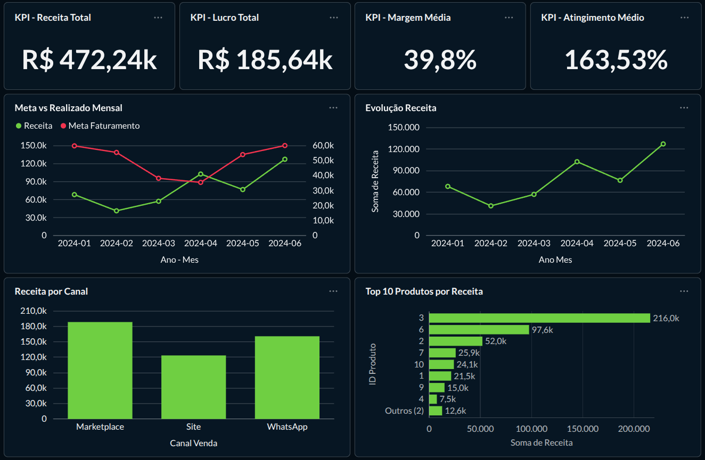

# 📊 Desafio Técnico — Estágio em Desenvolvimento de Dados
Fato Analytics

Este repositório contém a solução desenvolvida para o desafio técnico do processo seletivo.

O objetivo foi transformar dados brutos de um CRM (planilha Excel) em indicadores estruturados e insights relevantes para o negócio.

---

## 🧱 Estrutura do Projeto

- `01_certificacao_dados.ipynb` → Tratamento e validação dos dados  
- `02_camada_analitica.ipynb` → Construção dos indicadores  
- `dados_tratados.db` → Banco SQLite com dados certificados  
- `relatorio_executivo.md` → Explicação completa da estratégia e análises  

Após a etapa de tratamento, o Excel deixa de ser utilizado.  
O SQLite passa a ser a fonte oficial do projeto.

---

## 📈 Dashboard Executivo

O painel foi construído no Metabase, conectado diretamente ao banco SQLite.

Principais análises apresentadas:

- Receita total e mensal  
- Lucro total  
- Margem média  
- Meta vs realizado (mensal)  
- Receita por canal  
- Concentração por produto  

### 📷 Visual do Dashboard

---

## 🚀 Execução

Pré-requisitos:
- Python 3.9+
- Jupyter Notebook
- Bibliotecas: pandas, sqlite3

1. Executar `01_certificacao_dados.ipynb` → Gera o banco `dados_tratados.db`
2. Executar `02_camada_analitica.ipynb` → Constrói as tabelas analíticas
3. Conectar o Metabase ao arquivo `dados_tratados.db` → Criar dashboard utilizando as tabelas analíticas

---

## 📄 Observação

A documentação completa da estratégia, decisões técnicas e análise de resultados está disponível em `relatorio_executivo.ipynb`.
